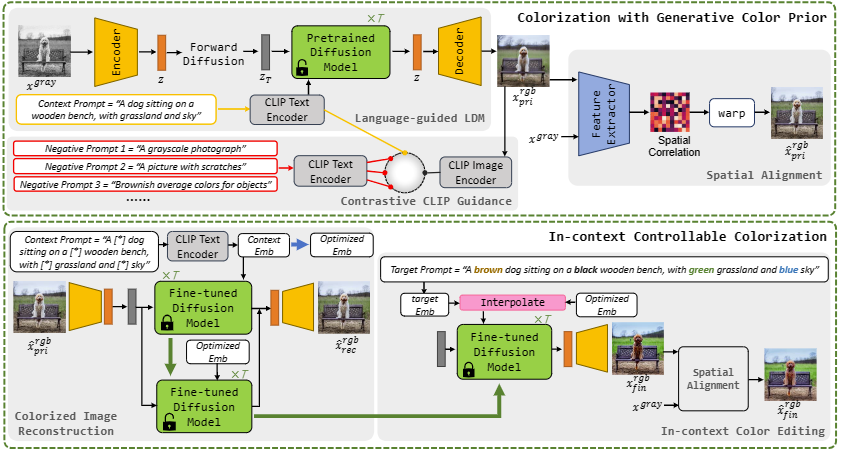

---  
layout: single  
title: "DiffColor: Toward High Fidelity Text-Guided Image Colorization with Diffusion Models"  
permalink: /diffcolor-paper/  
---  

**Paper Title:** DiffColor: Toward High Fidelity Text-Guided Image Colorization with Diffusion Models  

**Authors:** Jianxin Lin, Peng Xiao, Yijun Wang, Rongju Zhang, Xiangxiang Zeng  

**Abstract:** Recent data-driven image colorization methods have enabled automatic or reference-based colorization, while still suffering from unsatisfactory and inaccurate object-level color control. To address these issues, we propose a new method called DiffColor that leverages the power of pre-trained diffusion models to recover vivid colors conditioned on a prompt text, without any additional inputs. DiffColor mainly contains two stages: colorization with generative color prior and in-context controllable colorization. Specifically, we first fine-tune a pre-trained text-to-image model to generate colorized images using a CLIP-based contrastive loss. Then we try to obtain an optimized text embedding aligning the colorized image and the text prompt, and a fine-tuned diffusion model enabling high-quality image reconstruction. Our method can produce vivid and diverse colors with a few iterations, and keep the structure and background intact while having colors well-aligned with the target language guidance. Moreover, our method allows for in-context colorization, i.e., producing different colorization results by modifying prompt texts without any fine-tuning, and can achieve object-level controllable colorization results. Extensive experiments and user studies demonstrate that DiffColor outperforms previous works in terms of visual quality, color fidelity, and diversity of colorization options.  

**
Method
**

**
Colorization
**

